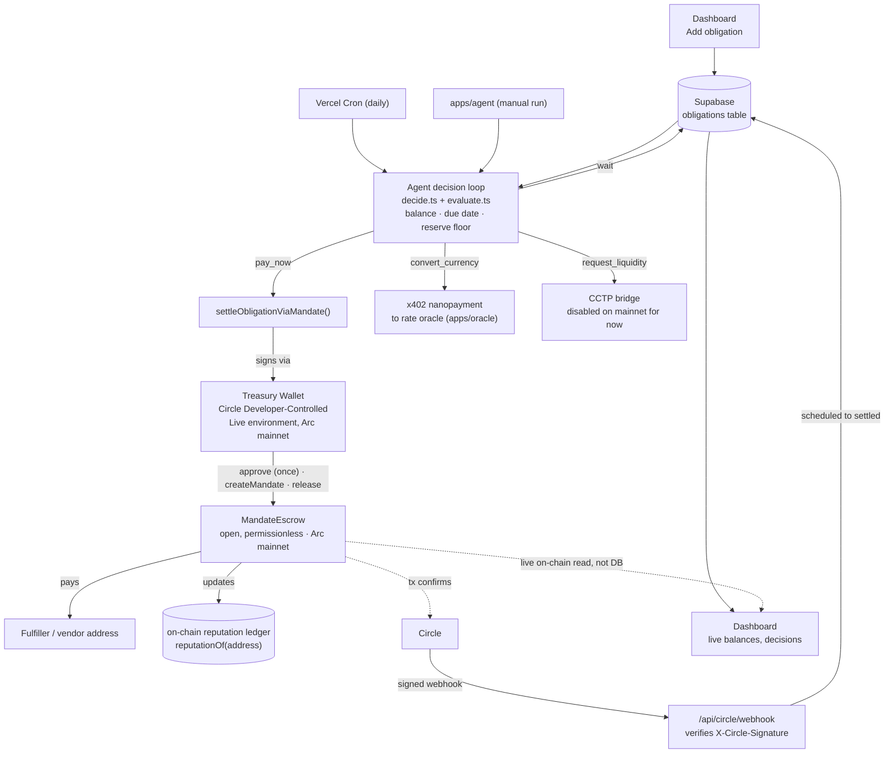

# Arcurrent



An open settlement primitive for agents on [Arc](https://arc.io), Circle's
stablecoin-native L1, and the autonomous treasury agent that's already its first live
user.

`MandateEscrow` is the primitive: any address can fund a mandate for anyone (or leave
it open), a fulfiller posts proof, the funder releases atomically with an optional
multi-destination split, refund-on-deadline, and every outcome updates an on-chain
reputation ledger. It's not project-owned.

Arcurrent's treasury agent is the first real caller of it: it watches a company's
payment obligations, decides when and how to settle them based on real signals
(balance, due dates, FX rate movement), converts currency via StableFX when a payment
isn't USDC-denominated, sources liquidity across chains via Circle Bridge Kit/Gateway
when the Arc balance is short, and pays sub-cent nanopayment fees to the rate oracle it
consults before every decision, all without a human in the loop, settling by creating
and releasing a mandate on `MandateEscrow`.

Started as a build for the [Build on Arc](https://arc.io) hackathon; now live on Arc
**mainnet**, submitted to Arc Microgrants.

Live dashboard: **https://arcurrent.site**

## Stack

| Layer | Choice | Why |
|---|---|---|
| Monorepo | npm workspaces | No extra tooling; pnpm hit a Windows/corepack permissions wall |
| Dashboard/API | Next.js (App Router) + Supabase | Mirrors Circle's own `arc-fintech` reference app |
| Agent | Node.js/TypeScript service (`apps/agent`) | Runs independently of the dashboard: autonomy means it isn't human-triggered |
| Wallets | `@circle-fin/developer-controlled-wallets` | Circle's real, self-serve wallet SDK |
| Cross-chain liquidity | `@circle-fin/app-kit` (Bridge Kit) via `@circle-fin/adapter-circle-wallets` | `kit.bridge()` signs through the same Circle-custodied wallets the rest of the app uses, no private key held for either side of the bridge |
| Nanopayments | `@circle-fin/x402-batching` (x402 protocol) | Real, self-serve, has a working Circle reference impl (`arc-nanopayments`) |
| FX conversion | StableFX (gated, see below) | Behind an adapter interface until access is granted |
| Contracts | Hardhat 3 + viem | Foundry's native Windows install path was too much friction for solo/4-week scope |

See [docs/STACK.md](docs/STACK.md) for the full verification notes (chain ID, RPC,
contract addresses, package versions, all independently confirmed against docs.arc.io,
chainlist.org, and the npm registry -- testnet on 2026-07-14, mainnet on 2026-09-22).

## Repo layout

```
apps/
  web/         Next.js dashboard + API routes + Circle webhooks
  agent/       Autonomous decision loop (reads obligations, decides, settles, logs)
  oracle/      x402-protected FX rate oracle: the agent pays it a sub-cent
               nanopayment via Circle Gateway before recording a convert_currency
               decision (real payment, real rate; StableFX itself stays gated)
packages/
  contracts/   Hardhat 3 project: MandateEscrow.sol, the open settlement primitive
               (live on Arc mainnet), and ObligationEscrow.sol, the earlier
               single-owner pool it generalizes (still deployed and tested on
               testnet, superseded as the live settlement path -- see Status)
  shared/      Shared types + Arc network config used by web and agent
```

## Status

Core spine is real end-to-end, no mock data anywhere in the path, live on **Arc
mainnet**:

- Dashboard (`apps/web`) lets a real user add an obligation (vendor, amount, currency,
  due date, destination address) via a Server Action into a real Postgres table
  (Supabase), and displays the live Circle treasury balance, the obligations list, the
  agent's decision log with links to Arc's mainnet explorer, and a live on-chain read
  of the Mandates table (not this project's own bookkeeping -- see below).
- The evaluation loop (`packages/shared/src/evaluate.ts`, built on the unit-tested
  `decide.ts`) reads pending obligations, decides against the treasury wallet's real
  USDC balance, due date, and a configurable reserve floor, and, when it decides to
  pay, settles by creating and releasing a mandate on `MandateEscrow`
  (`settleObligationViaMandate` in `packages/shared/src/mandate.ts`): approve once
  (max allowance, so it's not paying for an approve transaction on every obligation),
  `createMandate`, then `release`, with the resulting mandate id read back from the
  funder's own `MandateCreated` event in the transaction receipt (race-proof against
  other addresses calling the same permissionless contract, not guessed from
  `nextMandateId()`). Reasoning + tx hash get written back to the database either way,
  including on a failed evaluation (a per-obligation try/catch logs why and moves on,
  instead of one bad obligation aborting the whole pass). An atomic claim (conditional
  `pending -> scheduled` update) stops two overlapping evaluation passes from both
  settling the same obligation. There's exactly one implementation of this loop, run
  from two places: `apps/agent` (standalone, for local/manual runs) and a Vercel Cron
  route (`apps/web/src/app/api/cron/evaluate`, for it to actually run autonomously
  once deployed, see `apps/web/vercel.json`). The route fails closed on a
  missing/wrong `CRON_SECRET`, since a real hit here moves real USDC.
- `MandateEscrow.sol` (`packages/contracts`, deployed on Arc mainnet with its
  [source verified on the explorer](https://explorer.arc.io/address/0xca901f58fb82FE5FF459264a419b8cF8c75b3371?tab=contract),
  unit-tested with a mock USDC in an isolated local EVM) is the open primitive: any
  address can fund a mandate for anyone (or leave it open), a fulfiller posts proof,
  the funder releases atomically with an optional multi-destination split, refund on
  deadline, and every outcome updates an on-chain reputation ledger
  (`reputationOf(address)`). The treasury agent is just its first live caller, not its
  owner -- the contract has no owner. `ObligationEscrow.sol`, the original
  single-owner pre-funded-pool contract, is still deployed and tested on testnet but
  is no longer in this live settlement path.
- A webhook route (`/api/circle/webhook`) moves an obligation from `scheduled` to
  `settled`/`failed` once Circle confirms the onchain transaction. Every request's
  `X-Circle-Signature` is verified (ECDSA-SHA256 over the raw body) before anything is
  trusted; unverified/malformed requests get a clean `401`, never a crash. Setting
  `WEBHOOK_ENDPOINT_URL` alone does nothing -- Circle has to be explicitly told about
  the endpoint via `scripts/setup-webhook.ts create <url>` (a real gap found and
  fixed while actually deploying: the route existed and worked, but had never once
  been registered to receive anything).
- When Circle/Supabase credentials aren't configured, the app fails loudly with a
  clear error rather than falling back to fake data, confirmed by running it with an
  empty `.env`. The same applies to the reserve floor and pay-ahead window: a missing
  or invalid value throws instead of silently defaulting.
- **Nanopayments**: when an obligation is denominated in EURC, the agent pays
  `apps/oracle`'s `/rate` route a real `$0.001` x402 payment (Circle Gateway,
  gas-free, settled off-chain as a signed authorization, batched on-chain later)
  and gets back a live EUR/USD rate from a real public rate provider (no mock data).
  The rate, source, and payment id are written into the decision's signals. This
  doesn't execute a conversion, that part is still blocked on StableFX (see below).
  It proves the agent-pays-for-a-service nanopayment flow end-to-end.

Known gaps, tracked rather than faked:
- **StableFX** is gated (RFQ access, no self-serve signup): non-USDC obligations are
  correctly flagged `convert_currency` by the decision engine but not yet settled.
- **Cross-chain liquidity top-up** (`packages/shared/src/liquidity.ts`, bridges a
  shortfall from a second Circle-custodied wallet into the treasury via Bridge Kit's
  `kit.bridge()`) is proven working on testnet but **disabled on mainnet for now**:
  the existing liquidity wallet was created under Circle's Sandbox environment and
  isn't valid under the Live API key mainnet requires. `request_liquidity` falls back
  to its documented flag-only behavior until a Live-environment source wallet is
  funded. When it does run, it lands the bridged USDC directly in the treasury
  wallet and stops -- there's no separate pool to deposit into anymore now that
  settlement pulls straight from the wallet.

## Build on MandateEscrow

`MandateEscrow` is not Arcurrent-owned infrastructure -- it's a standalone, permissionless
primitive any address (a script, another agent, a different hackathon project) can call
directly, with no relationship to this repo required. Live on Arc mainnet at
[`0xca901f58fb82FE5FF459264a419b8cF8c75b3371`](https://explorer.arc.io/address/0xca901f58fb82FE5FF459264a419b8cF8c75b3371),
MIT-licensed source at
[`packages/contracts/contracts/MandateEscrow.sol`](packages/contracts/contracts/MandateEscrow.sol).

The whole interface is four write functions and one read:

```ts
import { createWalletClient, http, parseAbi, parseUnits } from "viem";
import { privateKeyToAccount } from "viem/accounts";

const mandateEscrowAbi = parseAbi([
  "function createMandate(address fulfiller, uint256 amount, uint256 deadline) returns (uint256)",
  "function submitProof(uint256 mandateId, bytes32 proofHash)",
  "function release(uint256 mandateId, address[] destinations, uint256[] amounts)",
  "function refund(uint256 mandateId)",
  "function reputationOf(address) view returns (uint64 completed, uint64 refunded, uint256 volumeSettled)",
]);

const ESCROW = "0xca901f58fb82FE5FF459264a419b8cF8c75b3371";
const USDC = "0x3600000000000000000000000000000000000000"; // fixed precompile, same on every Arc network

const wallet = createWalletClient({
  account: privateKeyToAccount(process.env.PRIVATE_KEY as `0x${string}`),
  chain: { id: 5042, name: "Arc", nativeCurrency: { name: "USDC", symbol: "USDC", decimals: 18 }, rpcUrls: { default: { http: ["https://rpc.mainnet.arc.io"] } } },
  transport: http(),
});

// 1. approve, then fund a mandate for a known fulfiller (or address(0) for "open, first proof wins")
await wallet.writeContract({ address: USDC, abi: parseAbi(["function approve(address,uint256) returns (bool)"]), functionName: "approve", args: [ESCROW, parseUnits("10", 6)] });
const mandateId = await wallet.writeContract({ address: ESCROW, abi: mandateEscrowAbi, functionName: "createMandate", args: ["0xFulfillerAddress", parseUnits("10", 6), 0n] });

// 2. the fulfiller posts proof once the work is done
// await fulfillerWallet.writeContract({ address: ESCROW, abi: mandateEscrowAbi, functionName: "submitProof", args: [mandateId, proofHash] });

// 3. the funder releases -- atomically, to one or more destinations
// await wallet.writeContract({ address: ESCROW, abi: mandateEscrowAbi, functionName: "release", args: [mandateId, [fulfillerAddr, feeAddr], [mostOfIt, smallFee]] });
```

Every mandate and every address also has a shareable page on the live site, read straight
from the contract: `/mandate/<id>` (state, terms, a proof verifier that re-hashes evidence
against the on-chain hash) and `/address/<0x…>` (an address's reputation and every mandate
it appears in). `/request` generates a payment-request link: put in your address and an
amount, send the link, and whoever opens it can lock that USDC in escrow for you in one
click, with the recipient and amount shown before they sign.

No registration, no allowlist, no fee to this project. `scripts/mandate-demo.ts` and
`scripts/mandate-split-demo.ts` run the full cycles (single payout, and an atomic
multi-destination split) end to end against the real mainnet contract and print every
tx hash -- read them for a complete working example, or just point a browser wallet at
the dashboard's "Use MandateEscrow yourself" panel and try it with no code at all.

## Setup

Local development, Arc Testnet -- free, no real money. See "Deploying to Arc mainnet"
below for what changes to actually go live.

1. `npm install` at the repo root (also builds `packages/shared`).
2. Copy `.env.example` to `.env`.
3. Create a Supabase project at [supabase.com](https://supabase.com), then run the
   migration in `supabase/migrations/` against it (`npx supabase db push` after
   `npx supabase link`), and fill in the Supabase values in `.env`.
4. Generate a Circle API key + entity secret at
   [console.circle.com](https://console.circle.com) and fill in `CIRCLE_API_KEY` /
   `CIRCLE_ENTITY_SECRET`.
5. `npm run setup:wallet`: creates the real treasury wallet on Arc Testnet and prints
   `TREASURY_WALLET_ID` / `TREASURY_WALLET_ADDRESS` to add to `.env`.
6. Fund that wallet from the [Circle faucet](https://faucet.circle.com) (select Arc
   Testnet), or once the app is running, the in-app `/faucet` page links to the same
   place.
7. Generate a throwaway deployer key (`generatePrivateKey()` from `viem/accounts`), fund
   it via the faucet, and set `ARC_TESTNET_DEPLOYER_PRIVATE_KEY`, this pays gas to
   deploy contracts and is separate from the Circle-custodied treasury wallet above.
8. `npm run deploy:mandate-escrow -w packages/contracts`: deploys `MandateEscrow` to
   Arc Testnet and prints its address; set `MANDATE_ESCROW_ADDRESS` in `.env` -- this
   is what the agent actually settles through. (`deploy:obligation-escrow` also exists
   if you want the legacy single-owner contract too; not required for the agent to
   work.)
9. Run `npm run mandate:demo -- <escrowAddress>` once (needs
   `MANDATE_DEMO_FUNDER_PRIVATE_KEY` / `MANDATE_DEMO_FULFILLER_PRIVATE_KEY`, two
   funded throwaway EOAs -- see `.env.example`) to prove the createMandate -> release
   cycle end to end before wiring up the agent.
10. Generate a second throwaway EOA (`AGENT_X402_PRIVATE_KEY`) and an address-only
    `ORACLE_SELLER_ADDRESS` (no key needed, it only receives payments). Fund the
    x402 key with native gas + USDC via the faucet, then run
    `tsx scripts/deposit-gateway.ts <amount>` once to fund its Circle Gateway balance.
11. `npm run setup:liquidity-wallet`: creates the cross-chain liquidity wallet on Base
    Sepolia and prints `LIQUIDITY_WALLET_ID` / `LIQUIDITY_WALLET_ADDRESS` to add to
    `.env`. Fund it via the [Circle faucet](https://faucet.circle.com) (select Base
    Sepolia). It needs **both** testnet ETH (gas for the CCTP burn call) and USDC (the
    amount to bridge). Confirmed the faucet does not reliably grant both from one
    request. Request each explicitly and check the wallet's native balance before
    relying on it, since a USDC-only balance makes `kit.bridge()` hang instead of
    failing (there's a 45s timeout guard around it in `liquidity.ts`, but that's a
    safety net, not a fix).
    Optional: without this, `request_liquidity` decisions are flagged but not acted on.
12. `npm run dev:oracle`: starts the rate oracle at `localhost:4000`.
13. `npm run dev:web`: dashboard at `localhost:3000`.
14. `npm run dev:agent`: runs one evaluation pass over pending obligations.

### Deploying (Vercel Cron for autonomous evaluation)

Deploy `apps/web` to Vercel (set its directory as the project root) with all the
`.env` values above as project env vars (including `LIQUIDITY_WALLET_ID`/
`LIQUIDITY_WALLET_ADDRESS` if you want autonomous liquidity top-ups, not just local
manual runs), plus a generated `CRON_SECRET`
(`node -e "console.log(require('crypto').randomBytes(32).toString('hex'))"`).
`vercel.json` schedules `GET /api/cron/evaluate` once daily (`0 6 * * *`). The
Hobby plan caps cron jobs at once per day, so this runs as often as that plan
allows. On a Pro plan or higher you can raise the frequency in `vercel.json`.
Without this, the agent only evaluates obligations when someone runs
`npm run dev:agent`/`start` manually, or when the dashboard's "Add obligation"
form triggers an immediate pass; with it, settlement genuinely runs with no
human in the loop, just once a day rather than continuously.

### Deploying to Arc mainnet

Everything above targets Arc Testnet by default. To actually go live on mainnet:

1. Get a **Live** Circle API key (console.circle.com, switch from Sandbox to Live) --
   a Sandbox/Test key cannot touch mainnet at all (error `156006`). See the Arc
   Mainnet gotchas in `docs/STACK.md` for the entity-secret-registration step this
   also requires (error `156016` if skipped) -- it's a separate registration per
   environment, not a config value you can copy from testnet.
2. Fund a real deployer EOA with a little native USDC (Arc's gas token) and set
   `ARC_MAINNET_DEPLOYER_PRIVATE_KEY` / `ARC_MAINNET_RPC_URL` in `.env`.
3. `npm run deploy:mandate-escrow:mainnet -w packages/contracts` (interactive --
   confirms before spending real gas; run it yourself in a real terminal, don't pipe
   `yes` into it).
4. `npm run setup:wallet` again with `ARC_NETWORK=mainnet` set -- this creates a
   **separate** mainnet treasury wallet under the Live API key; the testnet wallet
   isn't reachable once `CIRCLE_API_KEY` is Live-scoped. Fund it with real USDC.
5. Set `MANDATE_ESCROW_ADDRESS`, `TREASURY_WALLET_ID`/`TREASURY_WALLET_ADDRESS`, and
   `ARC_NETWORK=mainnet` as **production** env vars on Vercel (`vercel env add <NAME>
   production`), not just locally -- and unset/omit `LIQUIDITY_WALLET_ID` there too
   unless you have a real mainnet-side liquidity wallet (see Status above).
6. Deploy: `vercel --prod` from the repo root, `--project <name>` if the root's own
   `.vercel/project.json` happens to be linked to a different project than
   `apps/web`'s (check both before assuming -- redeploying the wrong project by
   accident is an easy mistake in this monorepo).
7. Register the webhook for real: `tsx scripts/setup-webhook.ts create
   https://<your-deployment>/api/circle/webhook`. Nothing does this automatically;
   `scripts/setup-webhook.ts list` shows what's currently registered.
8. If pointing a custom domain at it, `npx vercel domains inspect <domain>` prints
   the exact DNS record Vercel wants (usually `A @ 76.76.21.21`) and flags nameserver
   problems -- worth running even if the domain "looks" configured, since a
   registrar can silently park a domain (e.g. Namecheap's
   `failed-whois-verification.namecheap.com` nameservers if contact verification
   was never completed) without any obvious warning in its own dashboard.

### Deploying the oracle

`apps/oracle` deploys as its own separate Vercel project (it has its own
`vercel.json` rewriting all routes to `api/index`). Set `ORACLE_URL` in
`apps/web`'s project env vars to that deployment's public `/rate` URL.

Real incident, worth knowing: Vercel's per-deployment URLs
(`<project>-<hash>-<team>.vercel.app`) can sit behind Vercel's own
Deployment Protection (an SSO login wall) even when the project itself has
no protection configured for its stable domain. Pointing `ORACLE_URL` at a
deployment URL instead of the project's stable alias
(`https://<project>.vercel.app`) silently broke every `convert_currency`
evaluation for this project between initial deploy and 2026-08-07, every
attempt got redirected into the SSO wall and failed with a confusing 404,
not an auth error, and the per-obligation try/catch (see Status) meant it
failed quietly instead of loudly. Always use the stable alias, and confirm
with `curl <url>/rate` that it returns `402 Payment Required` (the correct
x402 response), not a redirect, before trusting it in `ORACLE_URL`.
