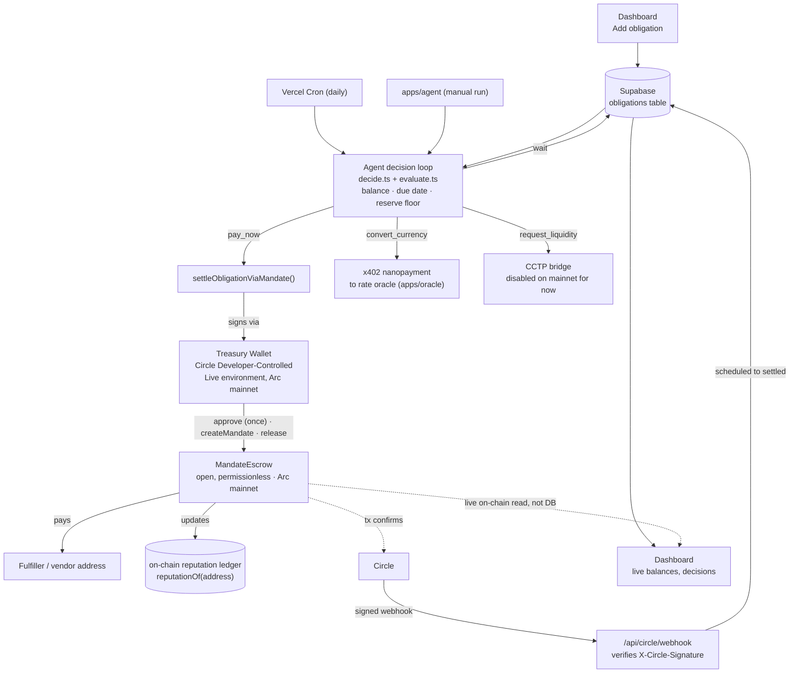

test 4 (exact README diagram)

```mermaid
flowchart TD
    U["Dashboard<br/>Add obligation"] --> DB[("Supabase<br/>obligations table")]
    CRON["Vercel Cron (daily)"] --> LOOP
    MANUAL["apps/agent (manual run)"] --> LOOP
    DB --> LOOP["Agent decision loop<br/>decide.ts + evaluate.ts<br/>balance · due date · reserve floor"]

    LOOP -->|pay_now| SETTLE["settleObligationViaMandate()"]
    LOOP -->|convert_currency| ORACLE["x402 nanopayment<br/>to rate oracle (apps/oracle)"]
    LOOP -->|request_liquidity| BRIDGE["CCTP bridge<br/>disabled on mainnet for now"]
    LOOP -->|wait| DB

    SETTLE -->|signs via| WALLET["Treasury Wallet<br/>Circle Developer-Controlled<br/>Live environment, Arc mainnet"]
    WALLET -->|"approve (once) · createMandate · release"| MANDATE["MandateEscrow<br/>open, permissionless · Arc mainnet"]

    MANDATE -->|pays| FULFILLER["Fulfiller / vendor address"]
    MANDATE -->|updates| REP[("on-chain reputation ledger<br/>reputationOf(address)")]

    MANDATE -.->|tx confirms| CW["Circle"]
    CW -->|signed webhook| WEBHOOK["/api/circle/webhook<br/>verifies X-Circle-Signature"]
    WEBHOOK -->|scheduled to settled| DB

    DB --> DASH["Dashboard<br/>live balances, decisions"]
    MANDATE -.->|live on-chain read, not DB| DASH
```
