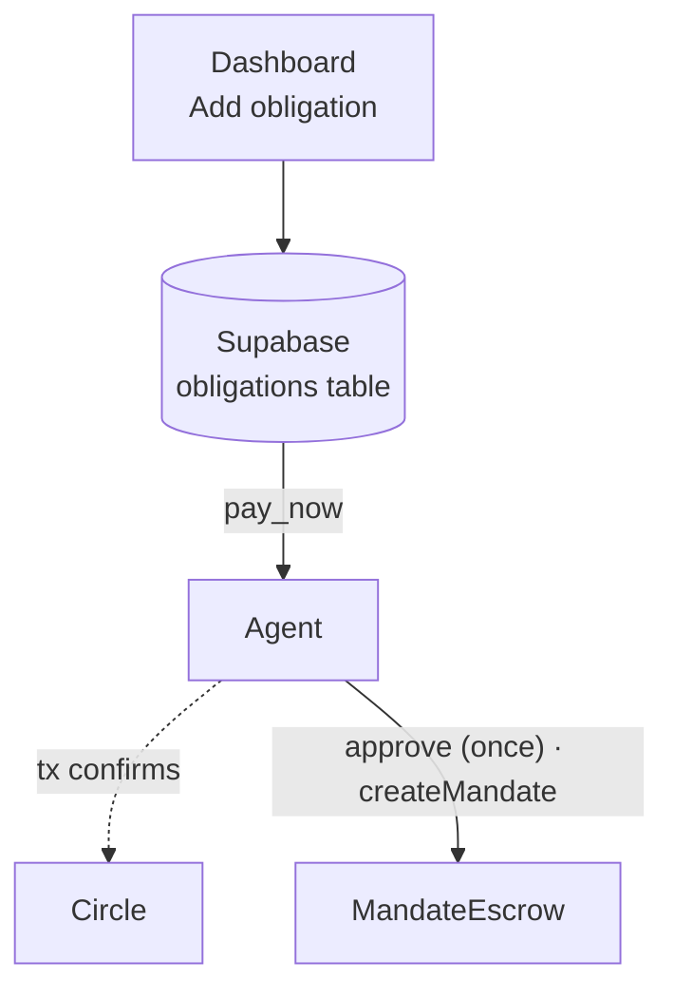

test 2

```mermaid
flowchart TD
    A["Dashboard<br/>Add obligation"] --> DB[("Supabase<br/>obligations table")]
    DB -->|pay_now| B["Agent"]
    B -.->|tx confirms| C["Circle"]
    B -->|"approve (once) · createMandate"| D["MandateEscrow"]
```
